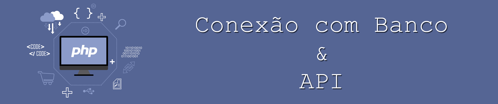

# Helper



Conjunto de classes auxiliadoras para projetos pequenos que não utilizam grandes frameworks.

Este helper possui auxiliares para:

* Conexão e Consulta em Banco (Conn) 
* Controle de recebimento de requisições (Server/Uri) 
* Saída simplificada em JSON para API (Server/Output)
* Execução de requisições (HttpRequest)

## Adicionando ao projeto

```shell
composer require szagot/helper
```

## Detalhamento de cada Helper

> **Obs**.: Há um projeto de backend de uma API de jogo que usa quase todos os Helpers dessa classe. Se quiser utilizar
> ele como exemplo, é o [szagot/ancient-backend](https://github.com/szagot/ancient-backend)

### Conexão ao Banco: `\Szagot\Helper\Conn`

Conectando ao banco

```php
$conn = new Connection(
    'banco',
    'localhost',
    'root',
    'senha'
);
```

Preparando base para execuções na conexão

```php
Query::setConn($conn);
```

Fazendo uma consulta diretamente

```php
$search = Query::exec(
    'SELECT * FROM tabela WHERE name LIKE :name',
    [
        'name' => "%{$name}%",
    ],
    MinhaClassePersonalizada::class
)
```

Fazendo a mesma requisição acima Crud

```php
try {
    $search = Crud::search(MinhaClassePersonalizada::class, 'name', "%{$name}%");
} catch (ConnException $e) {
    exit($e);
}
```

Fazendo uma inserção direta

```php
Query::exec(
    'INSERT INTO tabela (campo1, campo2) VALUES (:campo1, :campo2)',
    [
        'campo1' => $valor1,
        'campo2' => $valor2,
    ],
    MinhaClassePersonalizada::class
)

$id = Query::getLastLog()?->getLastId() ?? null;
```

Fazendo uma inserção com Crud

```php
try {
    $id = Crud::insert(MinhaClassePersonalizada::class, $minhaInstancia);
} catch (ConnException $e) {
    exit($e);
}
```

#### Utilizando o Crud

Para utilizar o Crud de modo correto, é necessário:

* Criar uma conexão do tipo Connection
* Adicionar ela na Query
* Ter models que tenham sido estendidos de aModel
* Usar os attributes obrigatórios Table e PrimaryKey
* Se um campo do seu model for extra, isto é, não tiver um campo de mesmo nome na tabela, use o atributo opcional
  IgnoreField

> **Obs**.: No caso de tabelas personalizadas que não possuam primary Key, utilize Query diretamente, sem Crud.

Exemplo básico:

```php
// Model
#[Table(name: 'nome_da_tabela_do_banco')]
class MinhaClassePersonalizada extends \Szagot\Helper\Conn\Model\aModel
{
    #[PrimaryKey]
    private int     $id;
    private ?string $campo1;
    private ?string $campo2;
    
    #[IgnoreField]
    private OutraClasse $campoQueNaoPertenceATabela;
}

// Preparando conexão
Query::setConn(
    new Connection(
        'banco',
        'localhost',
        'root',
        ''
    )
);

// Pegando um registro específico: ID = 1
try {
    /** @var MinhaClassePersonalizada $minhaInstancia */
    $minhaInstancia = Crud::get(MinhaClassePersonalizada::class, 1);
} catch (ConnException $e) {
    exit($e);
}
```

> **ATENÇÃO!** Se a chave primária não é do tipo de auto incremento, não esqueça de informar isso no atributo  
> PrimaryKey seguinte forma:

```php
// Model
#[Table(name: 'nome_da_tabela_do_banco')]
class MinhaClassePersonalizadaSemAutoIncremento extends \Szagot\Helper\Conn\Model\aModel
{
    #[PrimaryKey(autoIncrement: false)]
    private string  $code;
    private ?string $campo1;
    private ?string $campo2;
}
```

---

### Controle de Recebimento Requisições: `\Szagot\Helper\Server`

Emitindo saída do tipo JSON (`Content-type: application/json`):

```php
use Szagot\Helper\Server\Output;

// Saída com sucesso
Output:success($arrayDeSaida);

// Erro
Output::error('Deu ruim');
```

Você também pode especificar um cabeçalho da saída diferente do Padrão:

```php
// Saída com sucesso
Output:success($arrayDeSaida, Output::POST_SUCCESS);

// Erro
Output::error('Deu ruim', Output::ERROR_NOT_FOUND);
```

> **Obs**.: `Output::success` ou `Output::error` emitem a saída e matam a aplicação. Nada mais é executado após isso.

Pegando as requisições:

```php
use Szagot\Helper\Server\Uri;
use Szagot\Helper\Server\Models\Parameter;

$uri = Uri::newInstance();

// IP de quem fez a requisição
$requestIp = $uri->getRequestIp();
// Cabeçalhos da requisição recebida
$headers = getHeaders()
// Método (GET, POST, PUT, PATCH, DELETE, OPTION)
$method = $uri->getMethod();
// URL completa da requisição. Exemplo: "http://localhost:8080/pagina/opcao/detalhe"
$url = $uri->getUrl();
// String da Uri. Exemplo: "pagina/opcao/detalhe"
$uri = $uri->getTextUri();
// Primeira posição da Uri. Exemplo: "pagina"
$page = $uri->getUri(0);
// Arquivo de name "file" enviado
$file = $uri->getFile('file');
// Todos os arquivos enviados
$files = $uri->getFiles();

// Pegando parâmetros
$name = $uri->getParameter('name');
// Validando se o parâmetro "isGamer" foi informado na requisição
if($uri->parameterExists('isGamer')){
    $isGamer = $uri->getParameter('isGamer', Parameter::FILTER_BOOL);
}
```

**Alterando comportamento da URI**:

Caso sua API esteja hospedada em uma pasta diferente da raiz do servidor, você pode determinar o caminho fixo como
`root` da aplicação.

Dessa forma ele será ignorado pelos métodos.

Exemplo: Vamos supor que seu serviços esteja dentro de "https://servidor.com/caminho/da/aplicacao/", você pode fazer:

```php
use Szagot\Helper\Server\Uri;

$uri = Uri::newInstance('caminho/da/aplicacao');

$uriTxt = $uri->getTextUri();
$page = $uri->getUri(0);
$id = $uri->getUri(1);
```

No exemplo acima, se uma requisição for feita para "https://servidor.com/caminho/da/aplicacao/produto/20", os valores
das variáveis serão:

```txt
$uriTxt: "pagina/20"
$page..: "produto"
$id....: "20"
```

> **Obs**.: Se o `root` for informado com `newInstance()` ou com `setRoot()`, você não precisa informar novamente em
> outro ponto da sua aplicação. Toda instância feita de Uri manterá o root, a menos que você informe novamente com
> outros valores.

**Sobre os parâmetros**:

`$uri->getParameter('parametro')` ou `$uri->getParameters()` se refere a qualquer parâmetro enviado, quer via body, quer
via FormData ou mesmo Query String.

Em caso de duplicidade, os parâmetros informados no body terão prioridade.

Para pegar apenas o Body da requisição, use `$uri->getBody()`. Isso irá devolver um `stdClass` do body.

Ou use `$uri->getBody(false)` para devolver em formato string original.

---

### Execução de Requisições: `Szagot\Helper\HttpRequest`

Efetuando uma requisição

```php
use Szagot\Helper\Request\HttpRequest;

// URI do API
$uri = 'https://api.site.com.br/v1/collection'; 

// Preparando header
$header = [
    'Content-Type: application/json',
    'User-Agent: Exemplo',
];

// Preparando body
$body = [
    'campo1' => 'valor de exemplo',
    'campo2' => 99.9,
];

// Enviando requisição do tipo POST com Auth Basic
$envioExemplo = new HttpRequest( $uri, 'POST', $header );
$envioExemplo
    ->setBodyContent($body)
    ->setBasicUser('usuario')
    ->setBasicPass('senha')
    ->execute();

// Pegando dados do retorno
$response = $envioExemplo->getResponse();
$responseBody = $response->getBody();
$responseHttpStatus = $response->getStatus();
```

Se deseja enviar um arquivo na requisição, basta dar um addFileToRequest() após o setBodyContent(), da seguinte forma:

```php
// Arquivo
$file = $uri->getFile('file');
$body = [
    'campo1' => 'valor de exemplo',
    'campo2' => 99.9,
];

$envioExemplo
    ->setBodyContent($body)
    ->addFileToRequest($file)
    ->execute();

// Pegando dados do retorno
$response = $envioExemplo->getResponse();
$responseBody = $response->getBody();
$responseHttpStatus = $response->getStatus();
```